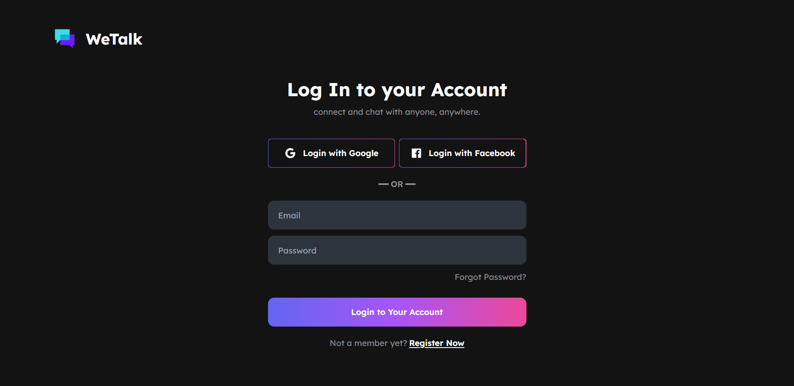
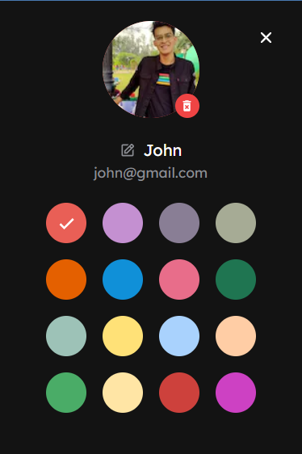
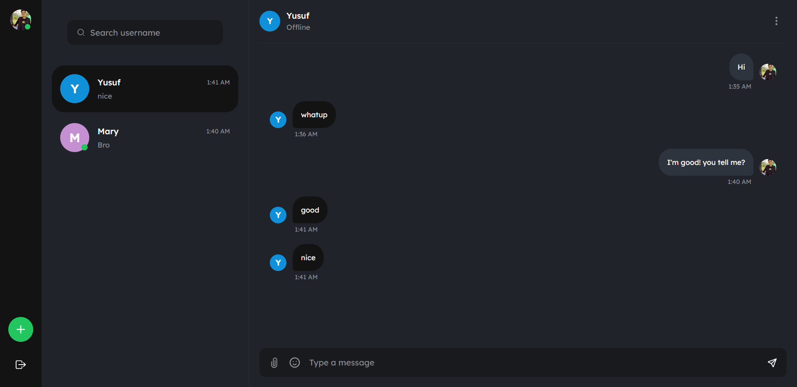
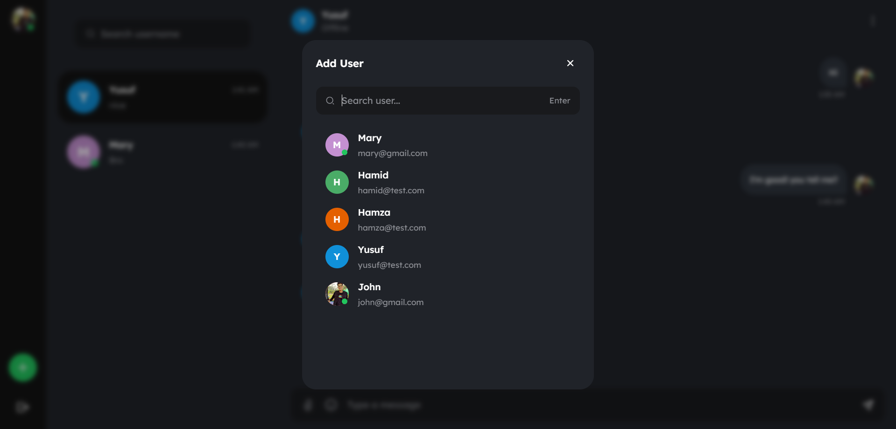
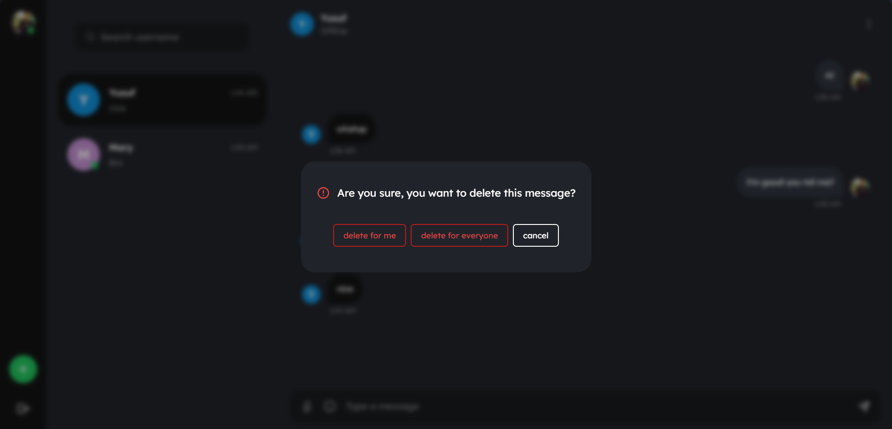

This is a Next.js project bootstrapped with create-next-app.

Getting Started
First, run the development server:

npm run dev
# or
yarn dev
# or
pnpm dev
Open http://localhost:3000 with your browser to see the result.

You can start editing the page by modifying pages/index.js. The page auto-updates as you edit the file.

API routes can be accessed on http://localhost:3000/api/hello. This endpoint can be edited in pages/api/hello.js.

The pages/api directory is mapped to /api/*. Files in this directory are treated as API routes instead of React pages.

This project uses next/font to automatically optimize and load Inter, a custom Google Font.

Learn More
To learn more about Next.js, take a look at the following resources:

Next.js Documentation - learn about Next.js features and API.
Learn Next.js - an interactive Next.js tutorial.
You can check out the Next.js GitHub repository - your feedback and contributions are welcome!

Deploy on Vercel
The easiest way to deploy your Next.js app is to use the Vercel Platform from the creators of Next.js.

Check out our Next.js deployment documentation for more details.

About
A realtime chat application built using NEXT JS, Tailwind, and Firebase

we-talk-nextjs.vercel.app
Resources
 Readme
 Activity
Stars
 0 stars
Watchers
 1 watching
Forks
 2 forks
Report repository
Releases
No releases published
Packages
No packages published
Deployments
18
 Production 4 months ago
+ 17 deployments
Languages
JavaScript
98.1%
 
CSS
1.9%
Footer
© 20
